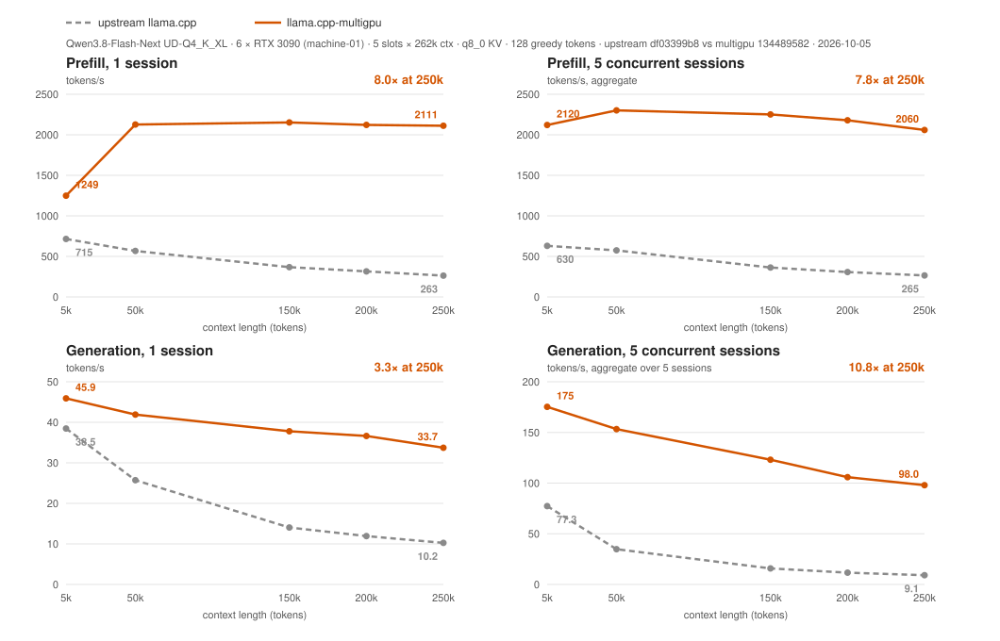

# llama.cpp-multigpu

[](../../releases)
[](#4-downloads)
[](https://github.com/lukolszewski/llama.cpp-multigpu/pkgs/container/llama.cpp-multigpu)
[](#1-performance-summary)
[](https://github.com/ggml-org/llama.cpp/commit/df03399b885831b2a1603b3abb0d8c156808e363)
[](LICENSE)

### Up to 8× faster prefill and up to 10× faster generation than stock llama.cpp — Qwen3.8-Flash-Next on consumer multi-GPU machines

Upstream's speed falls with context length and collapses under concurrency; this build stays flat. Measured
2026-10-05 on 6 × RTX 3090 (constrained PCIe), same model, same command line, upstream = the commit this
patchset branches from:

| workload | context | upstream llama.cpp | llama.cpp-multigpu | gain |
| --- | --- | ---: | ---: | ---: |
| prefill, 1 session | 50k | 568 t/s | **2127 t/s** | 3.7× |
| prefill, 1 session | 250k | 263 t/s | **2111 t/s** | **8.0×** |
| prefill, 5 sessions (aggregate) | 250k | 265 t/s | **2060 t/s** | 7.8× |
| generation, 1 session | 50k | 25.7 t/s | **41.9 t/s** | 1.6× |
| generation, 1 session | 250k | 10.2 t/s | **33.7 t/s** | 3.3× |
| generation, 5 sessions (per session) | 250k | 2.3 t/s | **27.3 t/s** | **10.8×** |



Full 20-row table and protocol: [§1](#1-performance-summary) · binaries and images: [§4](#4-downloads) · how to run it:
[§5](#5-usage) · what the 47 patches do: [docs/multigpu/patches.md](docs/multigpu/patches.md) · where it does **not**
help (other models, NVLink or single-GPU boxes, mixed prefill + decode): [§9](#9-known-limitations).

**STATUS: TEMPORARY DOWNSTREAM PERFORMANCE FORK.** This repository exists only while these workloads perform
materially better here than in upstream [`llama.cpp`](https://github.com/ggml-org/llama.cpp). The intended
end state is that upstream implements equivalent or better fixes and this repository is archived — **archiving
it because upstream caught up is the goal.** If your workload is not the one described here, use upstream.

It is still llama.cpp: same engine, same GGUF models, same `llama-server` API, same options, same upstream code
base, plus a targeted set of runtime-selected performance patches. It is not a new inference runtime, model
format, or ecosystem.

| | |
| --- | --- |
| Upstream | [ggml-org/llama.cpp](https://github.com/ggml-org/llama.cpp) — MIT licensed, remains the general-purpose project |
| Patched branch | [`multigpu`](../../tree/multigpu) (this page) — upstream + the performance patchset, and the source of all releases |
| Upstream-tracking branch | [`master`](../../tree/master) — kept as close to upstream as practical, never released from |
| Prebuilt binaries | [Releases](../../releases) — two Linux x86-64 CUDA builds per release (CUDA 12.9: V100 → RTX 5090; CUDA 13.4: Ampere+) plus `ghcr.io/lukolszewski/llama.cpp-multigpu` images; see [Downloads](#4-downloads) |
| Benchmarks | Measured 2026-10-05 on machine-01 (6 × RTX 3090): prefill 1.75–8×, decode 1.2–10.8× vs upstream — [Performance summary](#1-performance-summary); protocol and raw data in [docs/multigpu/benchmarks.md](docs/multigpu/benchmarks.md) |

---

## 1. Performance summary

Measured 2026-10-05 on `machine-01` (see [§2](#2-hardware-tested)); model Qwen3.8-Flash-Next
`UD-Q4_K_XL`; upstream commit `df03399b8` (the revision the patchset branches from, built with the same
recipe: CUDA 12.4.1, gcc 12, `86-real`); multigpu commit `134489582` (code identical to `e4054f726`, the
configuration in production on this machine). Both servers ran the same command line — 5 slots × 262144
context, `q8_0` KV cache, `-fa on`, `-b 2048 -ub 512`, layer split over six RTX 3090 — plus the fork's
runtime switches on the patched side (`LLAMA_DECODE_PIPELINE=1 LLAMA_SERVER_GROUPS=5 LLAMA_PIPELINE_PARALLEL=1
GGML_CUDA_GRAPHS_FORCE=1 LLAMA_ATTN_ROT_DISABLE=1`, `--prefill-max-partial 2`); lookup speculation was **off**.
Prompts are synthetic word lists of the stated token count (within 1 %: 4992 / 49678 / 148978 / 198628 /
248278 tokens); prefill = one request per slot with `cache_prompt: false`, generate = 128 greedy tokens on the
cached prompt at that depth. Units: tokens/s; for 5 slots the aggregate with the per-slot mean in parentheses.
Protocol, raw JSON and server logs: [docs/multigpu/benchmarks.md](docs/multigpu/benchmarks.md),
`benches/multi-gpu/machine-01-7950x-6x3090/2026-10-05-grid-df03399b8-vs-134489582/`.

| Workload | Context | Upstream llama.cpp | llama.cpp-multigpu | Improvement |
| --- | --- | --- | --- | --- |
| 1 slot - prefill | 5k | 715 | 1249 | 1.75x (+534 t/s) |
| 1 slot - generate | 5k | 38.5 | 45.9 | 1.19x (+7.4 t/s) |
| 1 slot - prefill | 50k | 568 | 2127 | 3.75x (+1560 t/s) |
| 1 slot - generate | 50k | 25.7 | 41.9 | 1.63x (+16.2 t/s) |
| 1 slot - prefill | 150k | 368 | 2152 | 5.86x (+1785 t/s) |
| 1 slot - generate | 150k | 14.1 | 37.8 | 2.69x (+23.7 t/s) |
| 1 slot - prefill | 200k | 315 | 2122 | 6.73x (+1806 t/s) |
| 1 slot - generate | 200k | 11.9 | 36.6 | 3.07x (+24.7 t/s) |
| 1 slot - prefill | 250k | 263 | 2111 | 8.02x (+1848 t/s) |
| 1 slot - generate | 250k | 10.2 | 33.7 | 3.29x (+23.5 t/s) |
| 5 slots - concurrent - prefill | 5k | 630 (388/slot) | 2120 (681/slot) | 3.37x (+1491 t/s) |
| 5 slots - concurrent - generate | 5k | 77.3 (18.2/slot) | 175.2 (42.3/slot) | 2.27x (+97.9 t/s) |
| 5 slots - concurrent - prefill | 50k | 574 (526/slot) | 2301 (1511/slot) | 4.01x (+1727 t/s) |
| 5 slots - concurrent - generate | 50k | 34.8 (8.1/slot) | 153.3 (38.3/slot) | 4.41x (+118.5 t/s) |
| 5 slots - concurrent - prefill | 150k | 363 (353/slot) | 2251 (1993/slot) | 6.20x (+1888 t/s) |
| 5 slots - concurrent - generate | 150k | 15.8 (3.6/slot) | 123.1 (32.4/slot) | 7.78x (+107.2 t/s) |
| 5 slots - concurrent - prefill | 200k | 307 (300/slot) | 2180 (1977/slot) | 7.11x (+1873 t/s) |
| 5 slots - concurrent - generate | 200k | 11.6 (2.8/slot) | 105.9 (29.0/slot) | 9.13x (+94.3 t/s) |
| 5 slots - concurrent - prefill | 250k | 265 (261/slot) | 2060 (1928/slot) | 7.77x (+1795 t/s) |
| 5 slots - concurrent - generate | 250k | 9.1 (2.3/slot) | 98.0 (27.3/slot) | 10.79x (+88.9 t/s) |

Reading the table: upstream's prefill rate falls with context (715 → 263 t/s from 5k to 250k) and its
decode rate collapses at depth and under concurrency (2.3 t/s per slot at five × 250k); the patched build
holds ~2100 t/s prefill at every depth and 27–46 t/s per slot of decode. The gains are therefore largest
exactly where the workload lives — long contexts, several sessions — and smallest at 5k single-slot
(1.2× decode). These numbers are for this machine's constrained-PCIe topology; see [§9](#9-known-limitations).

Mixed prefill + generation is deliberately absent from the headline table and is documented separately
in [docs/multigpu/benchmarks.md#mixed-workload-behavior](docs/multigpu/benchmarks.md#mixed-workload-behavior).
<!-- rented-machines:begin -->

Other machines (rented, one run each; same protocol, generated from the raw JSON by `vast-bench.sh land`; upstream = the fork's upstream base built with the same recipe when measured):

| machine | GPUs | prefill, 1 session (t/s) | generation, concurrent sessions (t/s) | upstream measured | run |
| --- | --- | --- | --- | --- | --- |
| [machine-02-6x4090](benches/multi-gpu/machine-02-6x4090/hardware.md) | 6 of 8 × NVIDIA GeForce RTX 4090 (191 GB in the box) | 744 → 7403 (10.0×) at 250k | 30.8 per session, 5 sessions at 250k | yes | [2026-10-06-grid-df03399-vs-6a8a599](benches/multi-gpu/machine-02-6x4090/2026-10-06-grid-df03399-vs-6a8a599/) |
<!-- rented-machines:end -->

## 2. Hardware tested

`machine-01`, the primary benchmark machine. Full record and per-field provenance:
[benches/multi-gpu/machine-01-7950x-6x3090/hardware.md](benches/multi-gpu/machine-01-7950x-6x3090/hardware.md).
Fields marked `TBD` are not yet measured (PCIe link state under load needs root); nothing here is estimated.

| Component | Value |
| --- | --- |
| CPU | AMD Ryzen 9 7950X (16C/32T) |
| RAM | 192 GB DDR5, 4 x 48 GB, JEDEC settings |
| Motherboard | ASUS ProArt X670E-CREATOR WIFI |
| GPUs | 6 x NVIDIA GeForce RTX 3090 (24 GB each, 144 GB aggregate) |
| Additional GPU | 1 x RTX 5060 Ti (16 GB) present in the machine, not part of the 6-GPU inference pool |
| Interconnect | consumer PCIe; GPUs largely behind PCIe host bridges, shared/constrained link widths (see below). GPUs 0 and 1 additionally hold a 4-link NVLink bridge |
| OS / kernel | Debian GNU/Linux 12 (bookworm), kernel 6.12.9 |
| NVIDIA driver | 595.99.02 (driver-reported CUDA 13.2) |
| Per-GPU PCIe width (idle) | GPU0 x8, GPU1 x8, GPU2 x4, GPU3 x2, GPU4 x4, GPU5 x4 |
| PCIe generation, LnkCap vs LnkSta under load | TBD (needs `sudo lspci -vv` re-measurement; idle links negotiate Gen1 in P8) |
| NUMA | 1 NUMA node exposed |
| CUDA toolkit on the benchmark host | none on the host; builds run in `nvidia/cuda:12.4.1-devel-ubuntu22.04` (nvcc 12.4.131) via `.devops/cuda.Dockerfile` |
| Compiler / toolchain | gcc 12, cmake 3.22 (Ubuntu 22.04 build image), Docker 20.10.24 |
| Model file(s) | `Qwen3.8-Flash-Next-UD-Q4_K_XL-0000{1,2,3,4}-of-00004.gguf`, ~111.3 GB total |
| Server command line, quant, batch, split-mode, env | recorded per run in [docs/multigpu/benchmarks.md](docs/multigpu/benchmarks.md#results) (2026-10-05 grid: 5 slots × 262144, `q8_0` KV, `-b 2048 -ub 512`, layer split, PLE on CPU) |

The constrained-PCIe topology is not incidental: it is the condition under which several of these
patches produce their effect. Results from this machine should not be assumed to transfer to systems
with fast GPU interconnects, and results from different machines are never merged into one table.
Additional machines (rented multi-4090 / multi-5090 / V100 boxes) get their own `machine-NN` directory and
configuration record, produced by the Vast.ai benchmark tooling in
[scripts/multigpu/bench/vast/](scripts/multigpu/bench/vast/README.md); their rows appear in §1 only once a
run exists.

## 3. Current target

| Category | Models | Status |
| --- | --- | --- |
| Primary | **Qwen3.8-Flash-Next** (llama.cpp arch `qwen4exp`) | the model the patches were written and measured against; the benchmark configuration is `unsloth/Qwen3.8-Flash-Next-GGUF`, `UD-Q4_K_XL` |
| Experimental | none yet | would need to be demonstrated before being listed |
| Might benefit, not demonstrated | Qwen3.8-27B, Qwen3.6-MoE, other architecturally related hybrid/sparse-attention MoE models | no claims made; treat as untested |

Qwen3.6, Qwen3.8 and Qwen3.8-Next are distinct model families. Sharing implementation details is not
the same as sharing support, so **no generic "Qwen support" is claimed here**. Multi-GPU work on other
architectures may benefit from the scheduler and graph changes, but that has not been measured.

Multi-token-prediction (MTP) drafts from the same Hugging Face repository are **out of scope**: they
help little in the single-user case and cost throughput in the multi-slot case, which is the opposite
of what this fork optimizes for. What *is* in: **n-gram lookup speculation** (prompt lookup decoding —
no draft model; repeats of the context such as code being rewritten, quotes or lists are proposed and
verified in one batch, output identical to greedy), made to work with the decode groups and capped by
default to at most two concurrently generating users, because a draft round costs every user a graph
re-plan. Measured on machine-01, solo, 1500 greedy tokens: code rewrite 44 → 111 t/s, prose with quotes
45 → 49, repetitive lists 45 → 75; with three or more users it is off and nothing changes.

The reference configuration (what runs on machine-01 since 2026-10-05): 5 slots × 262144 context,
`q8_0` KV cache, `-fa on`, `-b 2048 -ub 512`, layer split over six GPUs with the per-layer token embedding
on the CPU, decode groups = 5, prefill chunked beside decoders, asynchronous prompt-cache save/restore,
lookup speculation capped at 2 users.

## 4. Downloads

Prebuilt binaries are a first-class deliverable: many affected users do not build llama.cpp.

[Releases](../../releases) are date-tagged (`multigpu-YYYYMMDD`), permanent, and built by CI from the
tagged `multigpu` commit. Each release ships **two Linux x86-64 CUDA builds** with identical code:

| archive | CUDA | GPUs with native code (SASS) | PTX for other GPUs (compiled by the driver at load) | minimum driver |
| --- | --- | --- | --- | --- |
| `llama.cpp-multigpu-<date>-bin-ubuntu-cuda-12.9-x64.tar.gz` | 12.9 | V100 `sm_70`, RTX 30xx/A-series `sm_86`, RTX 40xx `sm_89`, RTX 50xx `sm_120a`/`sm_121a` | Maxwell `sm_50`, Pascal `sm_61`, Turing `sm_75`, A100 `sm_80`, H100 `sm_90` | R525+ for native targets; R570+ for Blackwell; R575+ (CUDA 12.9 PTX) for the PTX-only GPUs |
| `llama.cpp-multigpu-<date>-bin-ubuntu-cuda-13.4-x64.tar.gz` | 13.4 | `sm_86`, `sm_89`, `sm_120a`, `sm_121a` | `sm_80`, `sm_90` (CUDA 13 cannot target Maxwell/Pascal/Volta; Turing left out) | R580+ for the tarball; the **container image** needs a driver reporting CUDA ≥ 13.4 (NVIDIA base-image check; `-e NVIDIA_DISABLE_REQUIRE=1` bypasses it on 13.x drivers, verified on 13.2) |

Pick `cuda-12.9` unless you specifically want the CUDA 13 toolkit; the RTX 3090 benchmark machine runs it.
Next to each build: a `cudart-…` archive with the matching CUDA runtime + cuBLAS libraries (for hosts
without a toolkit), the patch series as `…-patches.tar.gz`, and `SHA256SUMS.txt`.

Container images (same archives, on NVIDIA's runtime base; `llama-server` is the entrypoint, run with
`--gpus all`):

- `ghcr.io/lukolszewski/llama.cpp-multigpu:server-cuda12.9-<date>` / `:server-cuda12.9` / `:latest`
- `ghcr.io/lukolszewski/llama.cpp-multigpu:server-cuda13.4-<date>` / `:server-cuda13.4`
- `ghcr.io/lukolszewski/llama.cpp-multigpu:server-cuda12.9-sm86` — RTX 3090-only image rebuilt on every
  push to `multigpu` (not a release; `-<sha7>` tags are the immutable ones)
- `ghcr.io/lukolszewski/llama.cpp-multigpu:bench-cuda12.9-<date>` / `:bench-cuda12.9` — the cuda-12.9 server
  image plus the benchmark grid runner for rented machines (one image from V100 to RTX 5090;
  [scripts/multigpu/bench/vast/](scripts/multigpu/bench/vast/README.md))

Each archive and image contains `BUILD_INFO.json` and `BUILD_INFO.txt` recording the `multigpu` commit,
the upstream llama.cpp base commit it sits on, the CUDA toolkit and compiler versions, the device
architectures (SASS and PTX), the exact CMake configuration, and the list of downstream patches. No
opaque binaries: if you can name the archive, you can name the source revision.

**Validation state is stated per artifact, not implied.** Public CI runners have no GPU, so CI proves
packaging and integrity (Tier A: archive unpacks, binaries run, the declared SASS/PTX targets are really
embedded, downstream flags are wired, metadata matches the commit) for every artifact. Runtime
validation on real hardware (Tier B) exists only for Linux / `sm_86` (6 × RTX 3090, the maintainer's
machine, the same configuration that serves production): both `multigpu-20261006` images served the model
there with the production flags (details in [docs/multigpu/builds.md](docs/multigpu/builds.md)). Every other architecture in these archives is
compiled, not run: those builds are ordinary llama.cpp builds, labelled "built and packaging-checked;
not runtime-validated by us". We do not withhold binaries that people need, and we do not attach test
claims we did not earn. Reports from other hardware (archive name, GPU model/count, driver) are the
evidence we lack. Details: [docs/multigpu/builds.md](docs/multigpu/builds.md).

Archives are weights-free. MIT covers the code; model weights remain under their own license, and no
GGUF is ever attached to a release.

## 5. Usage

Everything is normal llama.cpp usage; the patches are selected by environment variables and a few
extra server flags, so **one build carries the whole patchset** and no feature-specific binaries
exist. The complete switch table — default, effect, introducing commit — is in
[docs/multigpu/patches.md](docs/multigpu/patches.md). The main ones:

```sh
# one user, several concurrent sessions, 5 slots x 262k on 6 GPUs (the machine-01 production shape)
LLAMA_DECODE_PIPELINE=1 LLAMA_SERVER_GROUPS=5 \
LLAMA_PIPELINE_PARALLEL=1 GGML_CUDA_GRAPHS_FORCE=1 LLAMA_ATTN_ROT_DISABLE=1 \
LLAMA_SERVER_SPEC_MAX_USERS=2 \
llama-server \
  -m Qwen3.8-Flash-Next-UD-Q4_K_XL-00001-of-00004.gguf \
  -ngl 99 -sm layer -fa on -np 5 -c 1310720 \
  --cache-type-k q8_0 --cache-type-v q8_0 -b 2048 -ub 512 \
  -ot 'per_layer_token_embd\.weight=CPU' --tensor-split 0.85,1,1,1,1,1 \
  --prefill-max-partial 2 --cache-ram 81920 \
  --spec-type ngram-map-k4v
```

- `LLAMA_SERVER_GROUPS=5` (default `1` = off) — continuous per-sequence decode: the slots form pipelined
  groups whose batches overlap across the GPUs; this is the single largest multi-user gain (5 users at
  58k context: 17 → 34 t/s each on machine-01). Requires `LLAMA_DECODE_PIPELINE=1`.
- `LLAMA_DECODE_PIPELINE=1` (default `0`) — split a pure multi-sequence decode batch into per-sequence
  ubatches and run them through a stream-agnostic decode graph.
- `--spec-type ngram-map-k4v` with `LLAMA_SERVER_SPEC_MAX_USERS=2` — lookup speculation for one or two
  active users; leave it off if the server is mostly busy with 3+ sessions (it is then off anyway).
- `--prefill-max-partial N` (default `1`) — how many slots may prefill within one batch; with `1`, the
  first slot takes the whole batch and the others wait rather than thrashing the shared PCIe links.
- `--prefill-long-threshold N` / `--prefill-max-long N` — admit at most N "long" prompts concurrently,
  in arrival order.
- `--seq-compact` / `--no-seq-compact` (default enabled) — keep busy slots on contiguous sequence ids
  so they decode inside one ubatch.
- `LLAMA_QSA_BIAS_DEVICE` and `LLAMA_KQ_MASK_DEVICE` default to on; set to `0` to restore the host-side
  behaviour and compare.

Multi-GPU placement (`-sm`, `-ot`, `--tensor-parallel-size`, per-device memory) is upstream behaviour,
documented in [docs/multi-gpu.md](docs/multi-gpu.md). Context/batch/split settings that materially
affect these patches must be recorded with every benchmark result.

## 6. What is llama.cpp-multigpu?

A fork whose entire purpose is to make a specific class of llama.cpp workloads fast enough to be
usable *now*, while the corresponding upstream work is still in progress. The organizing loop is:

```
problem -> benchmark -> patch -> build -> measurable result
```

not "grow a platform". Each optimization is kept as an individually identifiable commit so it can be
compared against upstream, generalized, upstreamed, or deleted on its own. See
[docs/multigpu/patches.md](docs/multigpu/patches.md).

## 7. Why this fork exists

Upstream llama.cpp currently performs poorly for these workloads, and the gap is large enough that it
matters for daily use. Some findings were reported upstream; only a subset has been merged, and some
merged implementations do not fully close the gap. Rather than leave working fixes as fragments in
issue threads, this repository publishes them as a buildable, benchmarkable, downloadable branch.

Concretely, the fork exists to:

1. let affected users benefit from the fixes immediately;
2. serve people who do not compile llama.cpp via prebuilt binaries;
3. make the optimizations reproducible and benchmarkable;
4. give upstream maintainers and other developers an easy place to inspect the patches;
5. provide concrete evidence that specific performance problems exist;
6. let CUDA/ggml specialists improve or generalize the fixes on top of a working branch;
7. avoid forcing every discovery into a perfectly generalized upstream PR before anyone can use it;
8. keep a public technical record of the performance work.

## 8. Benchmark methodology

Summarized here; specified in [docs/multigpu/benchmarks.md](docs/multigpu/benchmarks.md).

- Two suites: one active slot, and five slots running concurrently (`-np 5`).
- Context/prompt sizes: 5k, 50k, 150k, 200k, 250k in both suites.
- Prefill and generation are measured as separate workloads; the five-slot suite has an all-prefill run
  and an all-generate run.
- Headline metrics: prompt-processing t/s, generation t/s, aggregate t/s, per-slot t/s, time to first
  token. Supporting: total prefill time, generation wall-clock, per-request latency, VRAM and host RAM,
  GPU utilization and PCIe traffic where reproducible.
- Every run records upstream commit, patched commit, machine, model + quant, command line, environment
  variables, slot count, context size, batch settings and tensor split. A number without its
  configuration is not a result.
- Reproduction scripts live in `scripts/multigpu/bench/` and the run directory; raw output lives in
  `benches/multi-gpu/<machine>/<run>/` (JSON, server logs, the chain log). The chart in the header is
  generated from those JSON files by `scripts/multigpu/bench/plot-grid.py`, never drawn by hand.

## 9. Known limitations

- **Highly workload-specific.** These patches target Qwen3.8-Flash-Next on consumer multi-GPU hardware.
- **Other models may not benefit** at all.
- **Some patches can make other workloads or hardware worse.** A change that helps on constrained
  PCIe links can regress a single-GPU or NVLink-connected machine. No patch is claimed to be
  universally correct, which is precisely why this is a targeted downstream patchset and not an
  assertion about llama.cpp in general. Benchmark documentation always names the tested hardware.
- **PCIe topology matters.** Constrained/shared links are the condition these patches address.
- **Mixed prefill + generation is better than it was, and still documented separately.** Prompts are
  prefilled in 256-token chunks beside the decoding slots (patches 28–36); on machine-01 two users
  decoding at 58k context while a 200k prompt is prefilled see ~280 ms between tokens instead of 1.3 s,
  and the prefill itself runs at roughly 60–70 % of its solo rate. Latency under concurrent
  prefill-while-generating is still worse than the all-prefill or all-generate numbers suggest, and it
  is published rather than hidden by cherry-picking the favourable workloads.
- **Intended serving model is multi-session single-user**, not multi-tenant: one person or workload
  owner running several concurrent sessions (several agent sessions, coding-agent tasks, independent
  chats, parallel research jobs). It is not currently a good fit for arbitrary unrelated requests
  arriving continuously with consistent per-user latency expectations.
- **Upstream rebases can break things.** llama.cpp moves fast; a sync may need conflict resolution and
  re-validation.
- **Benchmark coverage is limited to the hardware we own**, and public CI has no GPU.
- **One machine, one model.** The published numbers are from machine-01 and Qwen3.8-Flash-Next only; other machines' rows stay `TBD` until they are measured.

## 10. Relationship to upstream llama.cpp

Upstream is not a competitor. It is the project this work belongs to, and general-purpose users should
use it. This repository is an experimental proving ground for optimizations that may ultimately land
upstream.

- Each patch records the upstream issue/PR that discusses the problem
  ([docs/multigpu/patches.md](docs/multigpu/patches.md)).
- When upstream implements an equivalent fix, the local patch is re-benchmarked against it and
  **deleted** if it no longer earns its keep.
- Attribution, MIT license and upstream notices are preserved; the model architecture, weight format,
  API and CLI remain llama.cpp's.
- [docs/multigpu/upstream-sync.md](docs/multigpu/upstream-sync.md) documents the sync procedure:
  update `master` from upstream, rebase or merge `multigpu`, build, benchmark the important workloads,
  remove patches that became redundant.

## 11. Goals

- Make Qwen3.8-Flash-Next substantially faster on relevant consumer multi-GPU systems.
- Improve both prompt processing (prefill) and token generation.
- Focus on machines with many consumer GPUs behind constrained PCIe links.
- Improve the common case of one active session, and useful performance with several concurrent ones.
- Stay close to upstream llama.cpp with a small, understandable patch delta.
- Make every important performance difference measurable against a clearly identified upstream revision.
- Produce automatic binary builds and easy-to-download releases.
- Make it obvious which patches still provide value over upstream, and make removal easy.
- Serve as reference material and evidence for upstream development.

## 12. Non-goals

This project explicitly does **not** aim to:

- replace llama.cpp, or become a general-purpose inference runtime;
- introduce its own weight format, or an API incompatible with llama.cpp;
- create an incompatible model ecosystem;
- support every architecture or optimize every model;
- optimize every GPU arrangement, or guarantee better performance on every machine;
- become a commercial inference server or a multi-tenant serving platform;
- accumulate unrelated llama.cpp features, or accept feature work just because someone wants it in the fork.

## 13. Development / contributing

Branch layout: `master` mirrors upstream llama.cpp; `multigpu` is the patched branch, the default
branch, and the only branch CI builds and releases from. Never release from `master`.

Keep the history readable as `upstream + patch 1 + patch 2 + ...`: one logical optimization per commit,
`perf(multigpu): ...` prefix, and an `Upstream-ref: ggml-org/llama.cpp#NNNNN` trailer where it applies
(`scripts/multigpu/export-patches.sh` turns the range into `git format-patch` output, so users can pick
upstream, upstream + selected patches, or a full build). Contributions that fit:

- reproducing benchmarks on other multi-GPU hardware (especially 4090/5090 boxes);
- testing patches, and identifying regressions on configurations we cannot test;
- making a targeted fix general enough to upstream;
- benchmark tooling and build reproducibility.

For generic llama.cpp bugs or features, please use upstream llama.cpp — a fork that grows a feature
surface has stopped being useful for its actual purpose. Building and packaging:
[docs/multigpu/builds.md](docs/multigpu/builds.md).

## 14. Project status

Ongoing optimization work. Patchset: 47 commits, in production use on machine-01 since 2026-10-05
(validated there with the owner's own gate suite: 5-user coherence at 200k context, mixed prefill +
decode, client aborts, cache restore, 15-minute soak); benchmark protocol, CI and validation tiers
defined; benchmark numbers published 2026-10-05 ([§1](#1-performance-summary)); Tier B in public CI: **not run yet**
([§4](#4-downloads)).

**Success condition.** When upstream llama.cpp reaches roughly equivalent performance for these
workloads and the downstream patches stop providing material value, the correct outcome is to stop
maintaining them, point users at upstream, and archive this repository. An archived README would then
say: *Mission accomplished — upstream llama.cpp now provides comparable performance for the workloads
this fork was created to address. Use upstream.*

## Media / citation

- Preferred name: **llama.cpp-multigpu**
- Short description: *"A temporary llama.cpp performance fork focused on Qwen workloads on consumer
  multi-GPU systems."*
- Please keep "based on llama.cpp" visible in titles and descriptions; the project deliberately stays
  recognizably llama.cpp.

---

Based on [llama.cpp](https://github.com/ggml-org/llama.cpp) by [ggml-org](https://github.com/ggml-org)
and contributors, MIT licensed. See [LICENSE](LICENSE), [AUTHORS](AUTHORS) and the upstream
[README](https://github.com/ggml-org/llama.cpp#readme) for the full feature list, backend support
table and build guide.
